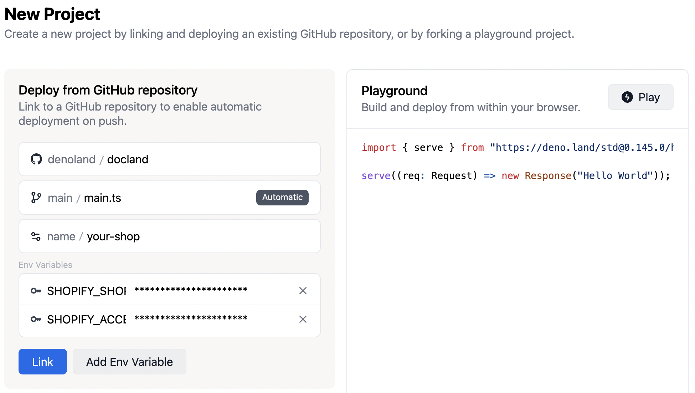

# Musa Merch

The Musa shop! Powered by [Shopify](https://www.shopify.com), and deployed to the edge with [Deno Deploy](https://deno.com/deploy).


## Develop locally

- Clone the repository
- Set up Shopify credentials in the `.env`, follows `.env.example`.
- Start the project in local mode:
  ```bash
  deno task start
  ```

## Shopify Configuration Guide

- Create a new account or use an existing one. https://accounts.shopify.com/store-login
- Create a new app. https://\<yourshopname>.myshopify.com/admin/settings/apps
- Once your app has been created, select use it. Then select "Storefront API integration" link
- Next, check Storefront API access scopes
  - `unauthenticated_read_product_listings` access should be fine to get you started. 
  - Add more scopes if you require additional permissions.

### Shopify Troubleshooting
- If you encounter an error like `error code 401` you likely didn't set this up correctly. Revisit your scopes and be sure add at least one test product. Also make sure you are using the `Storefront API` and not the `Admin API` as the endpoints and scopes are different.
- If you do not see a checkout sidebar, or if it is empty after adding a product, you need to add an image to your test product.

## Deploy to global

Sign in to [dash.deno.com](https://dash.deno.com), create a new project, and then link to your clone version of the repository. Please ensure add shopify secret before link:



## Perfect Lighthouse score

Today’s consumers are more demanding than ever, especially when it comes to
shopping online. These experiences must feel intuitive and snappy. Even a
[100-millisecond delay in load time can hurt conversion rates by 7%](https://s3.amazonaws.com/sofist-marketing/State+of+Online+Retail+Performance+Spring+2017+-+Akamai+and+SOASTA+2017.pdf).
